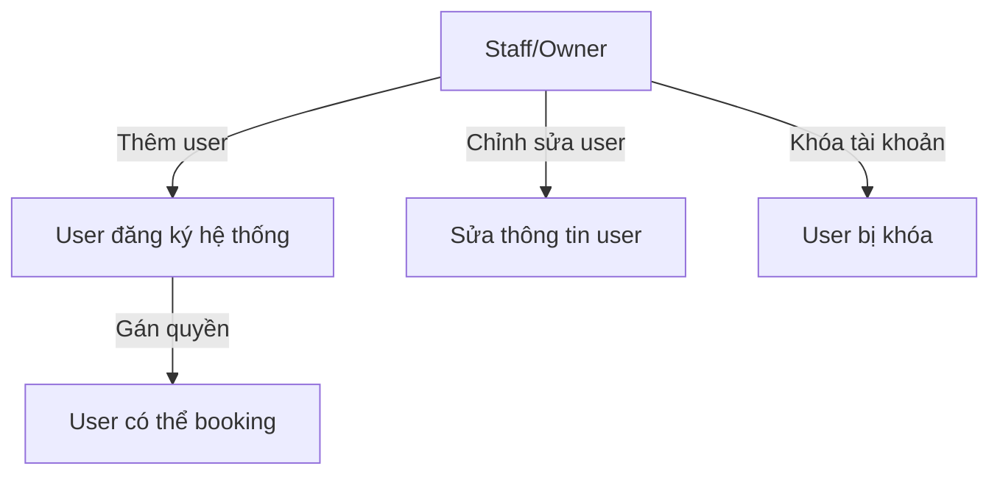
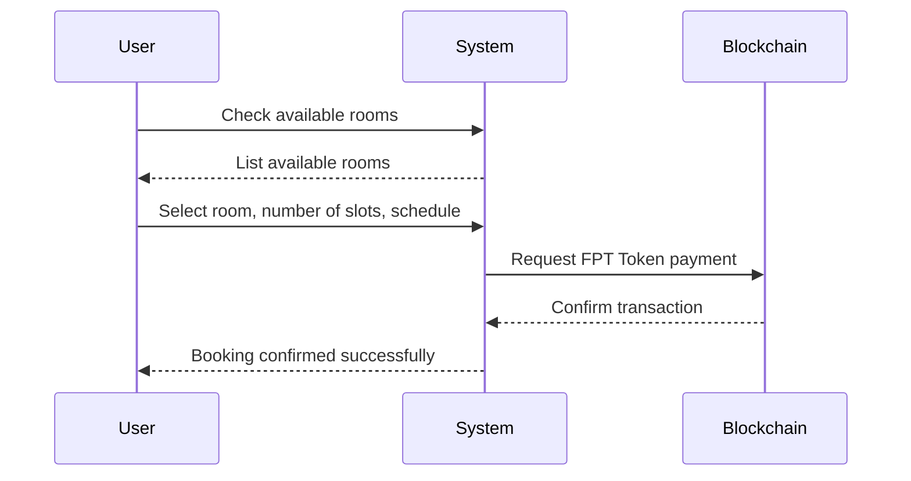
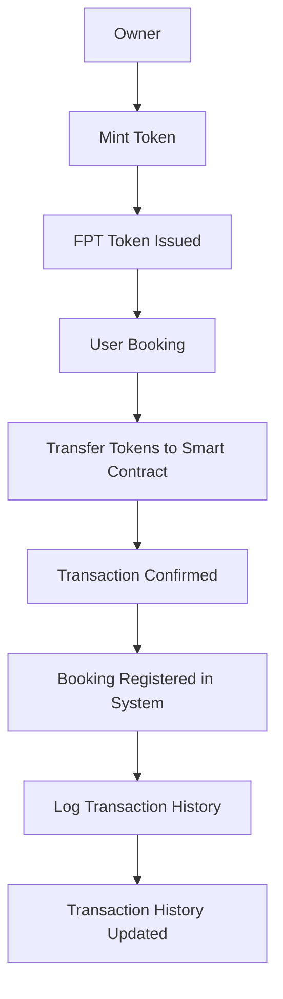

# 📌 HỆ THỐNG BOOKING PHÒNG LAB ĐẠI HỌC FPT
## 🌍 FPT UNIVERSITY LAB BOOKING SYSTEM

---

## 1️⃣ Giới thiệu | Introduction

### 📌 1.1. Tổng quan dự án | Project Overview
Hệ thống **Booking Phòng Lab Đại Học FPT** là một nền tảng đặt phòng lab dành riêng cho sinh viên FPT.
Sinh viên sử dụng **FPT CURRENCY (FPT Token - ERC20)** để đặt phòng, trong khi hệ thống sẽ quản lý lịch sử giao dịch và lịch đặt phòng minh bạch.

The **FPT University Lab Booking System** is a **blockchain-based** platform for students to book lab rooms using **FPT CURRENCY (FPT Token - ERC20)**.
The system ensures transparent booking records and transaction management.

### 🎯 1.2. Mục tiêu dự án | Project Goals
- ✅ **Tự động hóa quy trình đặt phòng lab.**
- ✅ **Sử dụng blockchain** để đảm bảo minh bạch.
- ✅ **Tích hợp FPT CURRENCY (ERC20 Token)** làm phương thức thanh toán duy nhất.
- ✅ **Phân quyền rõ ràng giữa các vai trò trong hệ thống.**

---

## 2️⃣ Chức năng hệ thống | System Features

### 👥 2.1. Quản lý người dùng | User Management
#### 🏆 Vai trò & quyền hạn | Roles & Permissions

| **Vai trò (Role)** | **Quyền hạn (Permissions)** |
|------------------|----------------------------------|
| **Owner** | Quản lý toàn bộ hệ thống. *(Full access)* |
| **Staff** | Quản lý user & chỉnh sửa phòng lab. *(Manage users & labs)* |
| **User**  | Chỉ có quyền booking phòng. *(Booking only)* |

#### 📝 2.1.1. Quản lý tài khoản | Account Management
- **Staff/Owner** có thể **thêm user** vào hệ thống bằng email & ví blockchain.
- **User không thể tự đăng ký**, chỉ có thể được **thêm bởi staff hoặc owner**.

- **Staff/Owner** can **add users** via email & blockchain wallet.
- **Users cannot self-register**, only **staff or owner can add them**.

#### 🔍 2.1.2. Quản lý danh sách user | User List Management
- **Staff có thể xem, chỉnh sửa thông tin user**.
- **Staff có thể khóa tài khoản user nếu có vi phạm**.

- **Staff can view & edit user details**.
- **Staff can suspend accounts for violations**.

---

### 🏦 2.2. Hệ thống Token - FPT CURRENCY | Token System
#### 💰 2.2.1. Thông tin token | Token Details
- **Tên | Name:** `FPT CURRENCY`
- **Symbol:** `FPT`
- **Tiêu chuẩn | Standard:** `ERC20`
- **Quyền mint | Minting Rights:** Chỉ Owner có quyền mint *(Only Owner can mint)*
- **Sử dụng | Usage:** Thanh toán booking phòng *(Booking payments)*

#### 💳 2.2.2. Quản lý số dư | Balance Management
- **User có thể kiểm tra số dư FPT Token.**
- **Token có thể được nạp/rút từ ví blockchain.**

- **Users can check their FPT Token balance.**
- **Tokens can be deposited/withdrawn from blockchain wallets.**

---

### 🏢 2.3. Hệ thống Booking Phòng Lab | Lab Booking System
#### 📌 2.3.1. Quy tắc booking | Booking Rules
- **Mỗi slot có giá 5 FPT.** *(Each slot costs 5 FPT)*
- **User có thể đặt từ 1 đến 5 slot.** *(Users can book 1-5 slots)*
- **Một phòng có nhiều slot mở cho booking.** *(Multiple slots per room)*

#### 📊 2.3.2. Thông tin booking | Booking Data

| **Trường (Field)** | **Mô tả (Description)** |
|-----------------|----------------------------------|
| `roomId`  | ID của phòng lab *(Lab room ID)* |
| `slot`    | Số lượng slot đặt (1-5) *(Number of slots)* |
| `user`    | Địa chỉ ví user *(User's wallet address)* |
| `price`   | Số FPT Token cần trả *(Total cost in FPT)* |
| `time`    | Ngày giờ booking *(Booking date & time)* |

---

## 3️⃣ Flow Hệ Thống | System Flow

> **Note:** These diagrams use Mermaid syntax and require a Markdown viewer with Mermaid support (like GitHub, GitLab, or VS Code with the Mermaid extension) to render properly.

### 👥 3.1. Flow quản lý người dùng | User Management Flow

### 🏢 3.2. Lab Booking Flow

### 💳 3.3. FPT Token Transaction Flow

## 🖥️ 4. Xem Trước Giao Diện Hệ Thống | System Interface Preview

> Hình ảnh minh họa giao diện sẽ được bổ sung sau | Interface mockups will be added later
